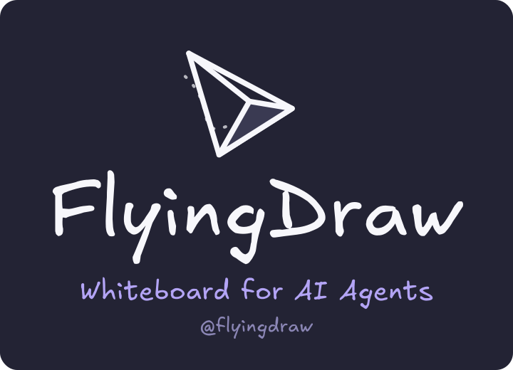

<p align="center">
  
</p>

# FlyingDraw

**Whiteboard for AI Agents.**

Give your AI Agent (e.g. Coding Agent) a live Excalidraw canvas — it learns to draw via a skill file you drop into your project, and diagrams appear in your browser in real time.

Works with **Claude Code · Codex CLI · Cursor · Gemini CLI · GitHub Copilot · Windsurf**

---

## What is FlyingDraw?

AI coding assistants only output text natively. FlyingDraw gives them a **visual output channel** — a live Excalidraw whiteboard they can draw on in real time.

You say `"wireframe the onboarding flow"`. Your agent reads the skill file, generates valid Excalidraw JSON, pushes it to the API, and the diagram appears in your browser instantly — no page reload. You can then annotate or edit the canvas yourself, and the agent can read back what you drew and continue from there.

FlyingDraw is hosted at [flyingdraw.com](https://flyingdraw.com). All you need to get started is a Google account.

---

## How your AI agent learns FlyingDraw

AI agents don't inherently know how to draw diagrams. FlyingDraw teaches them with a **skill file** — a plain markdown document you add to your project once.

The file contains two things:

1. **Your workspace URL** — the only project-specific config
2. **A fetch instruction** — tells the agent to pull the latest skill spec from GitHub before drawing

When triggered, the agent fetches [`skill.md`](./skill.md) from this repo and learns:

- **The Excalidraw JSON element format** — every required field for rectangles, ellipses, arrows, text, lines, and diamonds
- **Design rules** — 800px canvas, colour palette, roughness levels, z-ordering
- **Two API calls** — `GET /api/diagram` to read the current canvas, `PUT /api/diagram` to publish a new one

The skill spec is fetched fresh from GitHub every time — the agent always has the latest instructions, and you never update the stub file manually.

This approach works with any AI coding assistant that can read files and make HTTP requests.

---

## Prerequisites

All you need is a **Google account**. FlyingDraw is hosted at [flyingdraw.com](https://flyingdraw.com) — no setup required.

**Getting your workspace URL:**

- **New user:** Open [flyingdraw.com](https://flyingdraw.com) and sign in with Google. A private workspace is created automatically and its URL appears in the address bar — e.g. `https://www.flyingdraw.com/b450fda4-9a25-4414-abcd-237b16dfa1df`. Once signed in you can create additional workspaces from the workspace panel.
- **Joining a team workspace:** A team member shares the workspace URL with you. Open it and sign in with Google to join.

Workspaces support real-time collaboration — multiple people can view and edit the same canvas simultaneously.

---

## Get started in 4 steps

Every tool follows the same four steps — **only Step 1 differs by tool**. Steps 2–4 are identical for everyone.

### 1. Add the skill file

One small file teaches your AI tool how to draw — no install needed. Set up the file for your tool below, then continue to Step 2. (You'll fill in your workspace URL in Step 3 — leave the `YOUR-UUID` placeholder for now.)

#### Claude Code

**[⬇ Download flyingdraw.md](https://raw.githubusercontent.com/iamgq/flyingdraw-skills/main/flyingdraw.md)** — save it as `skills/flyingdraw.md` in your project root, or create it with this content:

```markdown
---
name: flyingdraw
description: Push wireframes to FlyingDraw canvas. Triggers on "flyingdraw", "wireframe", "sketch", "mock".
---

# FlyingDraw

**Workspace URL:** https://www.flyingdraw.com/YOUR-UUID
(Replace YOUR-UUID with your workspace UUID from the FlyingDraw browser tab.)

When triggered, fetch the latest skill instructions from GitHub:
- WebFetch https://raw.githubusercontent.com/iamgq/flyingdraw-skills/main/skill.md

Then follow the instructions using the Workspace URL above as FLYINGDRAW_URL.
Do not proceed without fetching.
```

Then register it in `CLAUDE.md`:

```markdown
## Skills
- **FlyingDraw** — Push wireframes to the live canvas. Invoke with "flyingdraw …",
  "wireframe …", "sketch …", etc. See `skills/flyingdraw.md`.
```

#### Codex CLI

Create `skills/flyingdraw.md` with this content:

```markdown
# FlyingDraw

**Workspace URL:** https://www.flyingdraw.com/YOUR-UUID
(Replace YOUR-UUID with your workspace UUID from the FlyingDraw browser tab.)

When triggered, fetch the latest skill instructions from GitHub:
- Fetch https://raw.githubusercontent.com/iamgq/flyingdraw-skills/main/skill.md

Then follow the instructions using the Workspace URL above as FLYINGDRAW_URL.
Do not proceed without fetching.
```

Then register it in `AGENTS.md`:

```markdown
## Skills
- **FlyingDraw** — Push wireframes to the live canvas. Invoke with "flyingdraw …",
  "wireframe …", "sketch …", etc. See `skills/flyingdraw.md`.
```

#### Cursor

Create `.cursor/rules/flyingdraw.mdc` with this content:

```markdown
---
description: Push wireframes to FlyingDraw canvas. Triggers on "flyingdraw", "wireframe", "sketch", "mock".
alwaysApply: false
---

# FlyingDraw

**Workspace URL:** https://www.flyingdraw.com/YOUR-UUID
(Replace YOUR-UUID with your workspace UUID from the FlyingDraw browser tab.)

When triggered, fetch the latest skill instructions from GitHub:
- Fetch https://raw.githubusercontent.com/iamgq/flyingdraw-skills/main/skill.md

Then follow the instructions using the Workspace URL above as FLYINGDRAW_URL.
Do not proceed without fetching.
```

#### Gemini CLI

Create `skills/flyingdraw.md` with this content:

```markdown
# FlyingDraw

**Workspace URL:** https://www.flyingdraw.com/YOUR-UUID
(Replace YOUR-UUID with your workspace UUID from the FlyingDraw browser tab.)

When triggered, fetch the latest skill instructions from GitHub:
- Fetch https://raw.githubusercontent.com/iamgq/flyingdraw-skills/main/skill.md

Then follow the instructions using the Workspace URL above as FLYINGDRAW_URL.
Do not proceed without fetching.
```

Then register it in `GEMINI.md`:

```markdown
## Skills
- **FlyingDraw** — Push wireframes to the live canvas. Invoke with "flyingdraw …",
  "wireframe …", "sketch …", etc. See `skills/flyingdraw.md`.
```

#### GitHub Copilot

Add to `.github/copilot-instructions.md` (create if it doesn't exist):

```markdown
## FlyingDraw

**Workspace URL:** https://www.flyingdraw.com/YOUR-UUID
(Replace YOUR-UUID with your workspace UUID from the FlyingDraw browser tab.)

When the user says "flyingdraw", "wireframe", "sketch", or "mock":
1. Fetch https://raw.githubusercontent.com/iamgq/flyingdraw-skills/main/skill.md
2. Follow the instructions using the Workspace URL above as FLYINGDRAW_URL.
Do not proceed without fetching.
```

#### Windsurf

Add to `.windsurfrules` in your project root (create if it doesn't exist):

```markdown
## FlyingDraw

**Workspace URL:** https://www.flyingdraw.com/YOUR-UUID
(Replace YOUR-UUID with your workspace UUID from the FlyingDraw browser tab.)

When the user says "flyingdraw", "wireframe", "sketch", or "mock":
1. Fetch https://raw.githubusercontent.com/iamgq/flyingdraw-skills/main/skill.md
2. Follow the instructions using the Workspace URL above as FLYINGDRAW_URL.
Do not proceed without fetching.
```

### 2. Create your workspace

Sign in with Google at [flyingdraw.com](https://flyingdraw.com) to open your own private workspace. This is your board.

### 3. Connect your workspace

Your agent needs two things — your workspace URL and a token. Get both from your **avatar menu** (top-right of your board):

- **Workspace URL** → click **Copy workspace URL**, then paste it into the skill file from Step 1 (it replaces the `YOUR-UUID` placeholder).
- **Token** → click **Get CLI Token**, then paste it into the chat when your agent asks. For your security it's never saved to a file.

> In a hurry? Skip the file edit — just paste your URL and token into the chat when your agent prompts you.

### 4. Just flyingdraw it

Ask your AI agent to "flyingdraw" just about anything — "flyingdraw a login screen" — and watch it appear live on your board.

---

## Usage

Once installed, trigger the skill in any session:

```
flyingdraw a login screen
wireframe the onboarding flow
sketch a dashboard with a sidebar
mock the checkout page
```

Your agent will:
1. Check FlyingDraw is reachable
2. Ask which project and board to save it under
3. Generate the Excalidraw wireframe JSON
4. Push it to your canvas via the API
5. Confirm with the board name and URL

---

## How it works

Once the stub file is in your project, everything is automatic:

1. You trigger the skill (`"flyingdraw a login screen"`)
2. Your agent reads the stub → finds your workspace URL
3. It fetches `skill.md` from this repo → learns the Excalidraw JSON format, design rules, and API workflow in one pass
4. It generates valid diagram JSON and calls `PUT /api/diagram` with your workspace URL + token
5. The diagram appears in your browser instantly — no refresh needed
6. Your agent can also call `GET /api/diagram` to read what's on the canvas — so you can draw something yourself and have the agent annotate or extend it

**You never need to clone this repo, visit GitHub, or manage skill instructions manually.**
The stub file is the only file you own — the skill logic is always fetched fresh from the latest version here.

---

## Advanced / contributing

The full skill instructions live in [`skill.md`](./skill.md). You don't need to read it to use the skill — it's there if you want to understand how the agent generates wireframes, or to contribute improvements.

It covers:
- Board and project structure
- Step-by-step draw workflow
- Excalidraw JSON element format reference
- Design principles and colour palette
- PlantUML and Mermaid diagram conversion
- All supported trigger phrases
